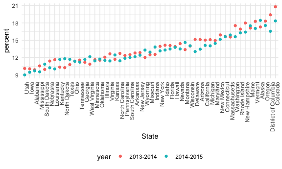

Strings and Factors
================
Tara
10/27/2021

``` r
library(tidyverse)
```

    ## ── Attaching packages ─────────────────────────────────────── tidyverse 1.3.1 ──

    ## ✓ ggplot2 3.3.5     ✓ purrr   0.3.4
    ## ✓ tibble  3.1.4     ✓ dplyr   1.0.7
    ## ✓ tidyr   1.1.3     ✓ stringr 1.4.0
    ## ✓ readr   2.0.1     ✓ forcats 0.5.1

    ## ── Conflicts ────────────────────────────────────────── tidyverse_conflicts() ──
    ## x dplyr::filter() masks stats::filter()
    ## x dplyr::lag()    masks stats::lag()

``` r
library(rvest)
```

    ## 
    ## Attaching package: 'rvest'

    ## The following object is masked from 'package:readr':
    ## 
    ##     guess_encoding

``` r
library(httr)


knitr::opts_chunk$set(
  fig.width = 6,
  fig.asp = .6,
  out.width = "90%"
)

theme_set(theme_minimal() + theme(legend.position = "bottom"))

options(
  ggplot2.continuous.clour = "viridis",
  ggplot2.continuous.fill = "viridis"
)

sclae_colour_discrete = scale_color_viridis_d()
scale_fill_discrete = scale_fill_viridis_d
```

``` r
library(rvest)
library(p8105.datasets)
```

## Strings and regex

``` r
string_vec = c("my", "name", "is", "jeff")

str_detect(string_vec, "jeff")
```

    ## [1] FALSE FALSE FALSE  TRUE

``` r
str_replace(string_vec, "jeff", "Jeff")
```

    ## [1] "my"   "name" "is"   "Jeff"

``` r
string_vec = c(
  "i think we all rule for participating",
  "i think i have been caught",
  "i think this will be quite fun actually",
  "it will be fun, i think"
  )

str_detect(string_vec, "^i think")
```

    ## [1]  TRUE  TRUE  TRUE FALSE

``` r
str_detect(string_vec, "i think$")
```

    ## [1] FALSE FALSE FALSE  TRUE

`str_detect` could go with `filter` `str_replace` could go with `mutate`
(can replace with nothing to get rid of it too)

Strings are case sensitive!

Carrot refers to **begining of line** Dollar sign is for **end of the
line**

``` r
string_vec = c(
  "i think we all rule for participating",
  "i think i have been caught",
  "i think this will be quite fun actually",
  "it will be fun, i think"
  )

str_detect(string_vec, "^i think")
```

    ## [1]  TRUE  TRUE  TRUE FALSE

``` r
str_detect(string_vec, "i think$")
```

    ## [1] FALSE FALSE FALSE  TRUE

The brackets act like “or”:

``` r
string_vec = c(
  "Y'all remember Pres. HW Bush?",
  "I saw a green bush",
  "BBQ and Bushwalking at Molonglo Gorge",
  "BUSH -- LIVE IN CONCERT!!"
  )

str_detect(string_vec,"[Bb]ush")
```

    ## [1]  TRUE  TRUE  TRUE FALSE

Is there anything in here that’s a number followed by two letters?:

``` r
string_vec = c(
  '7th inning stretch',
  '1st half soon to begin. Texas won the toss.',
  'she is 5 feet 4 inches tall',
  '3AM - cant sleep :('
  )

str_detect(string_vec, "^[0-9][a-zA-Z]")
```

    ## [1]  TRUE  TRUE FALSE  TRUE

The . means “literally anything”. "is there anything that’s a 7 followed
by something?

``` r
string_vec = c(
  'Its 7:11 in the evening',
  'want to go to 7-11?',
  'my flight is AA711',
  'NetBios: scanning ip 203.167.114.66'
  )

str_detect(string_vec, "7.11")
```

    ## [1]  TRUE  TRUE FALSE  TRUE

``` r
str_detect(string_vec, "711")
```

    ## [1] FALSE FALSE  TRUE FALSE

If you’re looking for “\[” then you have to put a "" but that’s also a
special character so you have to put two \\. This applies to a bunch of
special characters like . or \[ / ( .

``` r
string_vec = c(
  'The CI is [2, 5]',
  ':-]',
  ':-[',
  'I found the answer on pages [6-7]'
  )

str_detect(string_vec, "\\[")
```

    ## [1]  TRUE FALSE  TRUE  TRUE

## Why factors are weird

``` r
factor_vec = factor(c("male", "male", "female", "female"))

as.numeric(factor_vec)
```

    ## [1] 2 2 1 1

``` r
factor_vec = fct_relevel(factor_vec, "male")
```

It makes things alphabetic when you don’t define ref group.

Going numeric is based on male being second factor level, female first.

Making male the first factor level with `fct_relevel`

## NSDUH

Remember, slice takes out the first row.

``` r
nsduh_url = "http://samhda.s3-us-gov-west-1.amazonaws.com/s3fs-public/field-uploads/2k15StateFiles/NSDUHsaeShortTermCHG2015.htm"

table_marj = 
  read_html(nsduh_url) %>% 
  html_table() %>% 
  first() %>%
  slice(-1)
```

Look at the data with `table_marj %>% view` in the console

Oh no, the numbers are characters (because there’s an a). Prevalences
are also spread across multiple columns. Untidiness in headers with age
groups and years in one cell. Address these so we can make a plot.

Clean up!

-   Take out p value
-   Here’s the prevalence, age group, year, percent of people who
    responded yes = wide to long format problem = pivot it all except
    for *state*
-   Separate age year by splitting by parentheses (special character)
-   Change year to get rid of parentheses
-   Replace all the a-b letters at the tail ends with nothing to get rid
    of them
-   Make percent numeric
-   Filter bc we want states only so get rid of the general terms, put
    the opposite sign in filter statement

``` r
marj_df = 
  table_marj %>%
  select(-contains("P Value")) %>%
  pivot_longer(
    -State,
    names_to = "age_year", 
    values_to = "percent") %>%
  separate(age_year, into = c("age", "year"), sep = "\\(") %>%
  mutate(
    year = str_replace(year, "\\)", ""),
    percent = str_replace(percent, "[a-c]$", ""),
    percent = as.numeric(percent)) %>%
  filter(!(State %in% c("Total U.S.", "Northeast", "Midwest", "South", "West")))
```

Make a plot! Dataframe stuff

-   You can mutate to factor reorder by state’s average percent, factor
    reorder converts it from string to factor and orders it

``` r
marj_df %>%
  filter(age == "12-17") %>% 
  mutate(State = fct_reorder(State, percent)) %>% 
  ggplot(aes(x = State, y = percent, color = year)) + 
    geom_point() + 
    theme(axis.text.x = element_text(angle = 90, hjust = 1))
```



## Restaurant inspections

``` r
library(p8105.datasets)

data("rest_inspec")

rest_inspec = 
rest_inspec %>% 
  filter(
    str_detect(grade, "[ABC]"),
    !(boro == "Missing")
  ) %>% 
  mutate(boro = str_to_title(boro))
```

See the first 100 rows by putting
`rest_inspec %>% slice(1:100) %>% view()` in console

ERROR: `boro` not found for some reason when doing `janitor::tabyl`

Let’s find pizza places

-   Name is case sensitive
-   Mutate to order it by borough

``` r
rest_inspec %>% 
  filter(str_detect(dba, "[Pp][Ii][Zz][Zz][Aa]")) %>% 
  mutate(
    boro = fct_infreq(boro)
  ) %>% 
  ggplot(aes(x = boro, fill = grade)) +
  geom_bar()
```


What about changing a label … R is picky.

``` r
rest_inspec %>% 
  filter(str_detect(dba, "[Pp][Ii][Zz][Zz][Aa]")) %>% 
  mutate(
    boro = fct_infreq(boro),
    boro = fct_recode(boro, "The City" = "Manhattan")
  ) %>% 
  ggplot(aes(x = boro, fill = grade)) +
  geom_bar()
```


